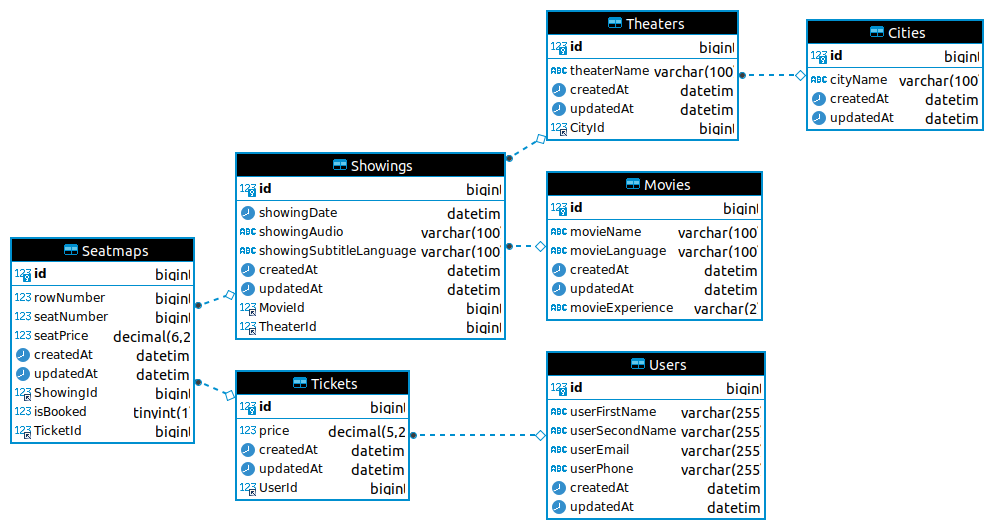

# Movie Booking API

## Introduction
This project implements API endpoints to allow a user to search for theaters in their city, find dates with available shows for a particular theater, and then view all showings for that theater for a particular day.

## Which columns to index?

If the performance for the endpoint that fetches the list of all showings on a given date reduces, it would make sense to index the showingDate column as that is the column we are using in the WHERE queries. To support this change, we can also split the showingDate column into Date and Time separately and index on the Date. This would help improve the specificity of our index and increase the odds of it actually being used in the query. 

It would also make sense to index all the columns that are used as foreign keys (TheaterID and MovieID in showings table for example), although MySQL seems to do this automatically. 

## Endpoints
-   **GET /api/city/:cityid**: Fetches a list of all theaters in a city.
    
-   **GET /api/city/:cityid/theater/:theaterid**: Fetches a list of dates in the next 7 days for which the theater has showings.
    
-   **GET /api/city/:cityid/theater/:theaterid/date/:yyyy-:mm-:dd**: Returns a list of showings for the selected theater and date, with details about the movies language, rating, subtitles, start times etc.

-   **GET /api/getSeats/:showingid**: Returns the list of available seats for the selected Showing ID.

-   **POST /api/bookSeats**: Allows the user to book available seats.

| Parameter | Type     | Description                       |
| :-------- | :------- | :-------------------------------- |
| `userId`      | `integer` | **Required**. User ID of the user booking. |
| `showingId`      | `integer` | **Required**. Showing Id of the showing to book tickets for. |
| `seatList`      | `array` | **Required**. IDs of the seats to book.|

## ER Diagram
